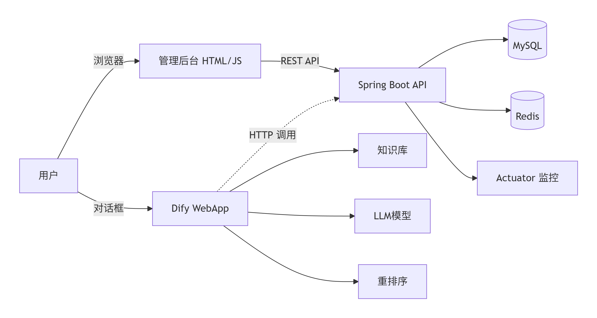
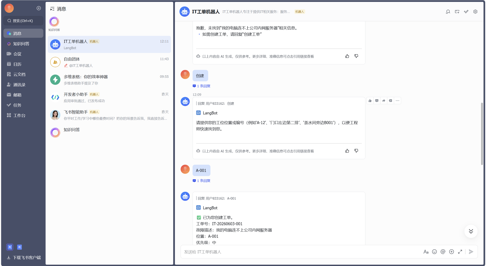
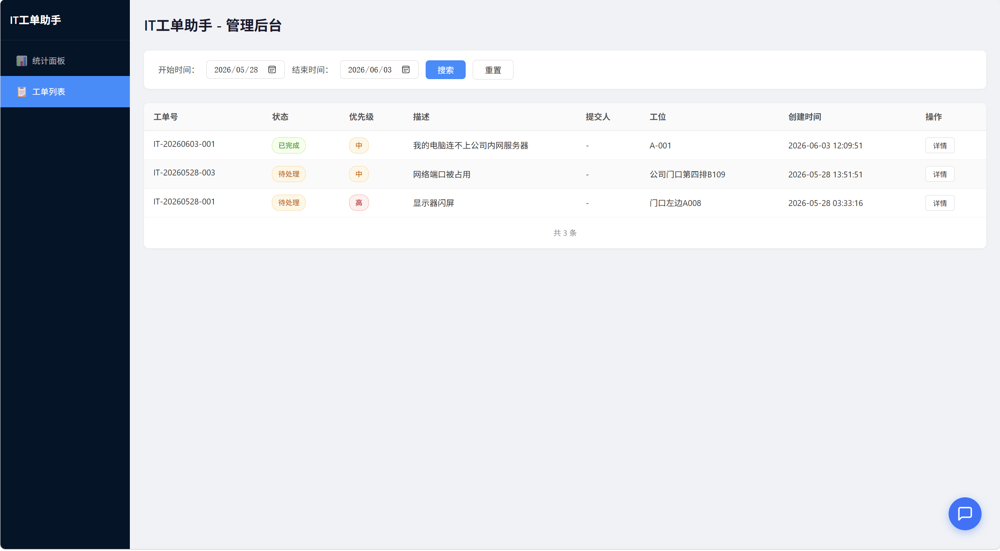
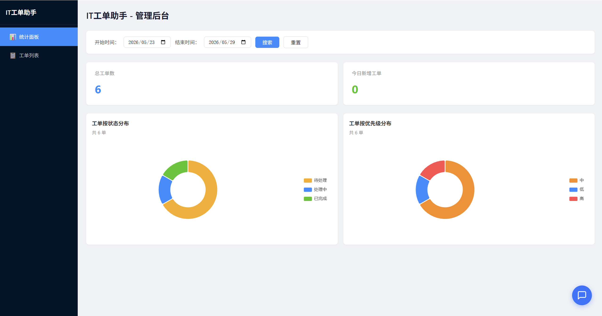
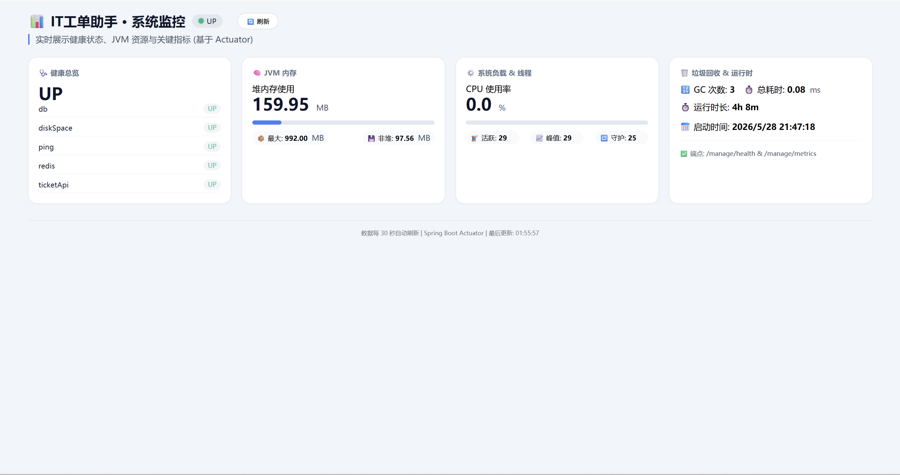

# IT 工单助手 — 企业级智能工单系统


> 基于 **Spring Boot + Dify + Actuator** 的智能 IT 工单助手，支持自然语言创建/查询工单、知识库问答、多轮对话状态机、管理后台监控与 Dify 聊天窗集成。

---

## 📖 简介

IT 工单助手是一个企业级全栈应用，结合低代码 AI 编排平台 [Dify](https://dify.ai/) 与 Spring Boot 后端，实现以下核心能力：

- ✅ 自然语言意图识别（创建工单 / 查询工单 / 知识库问答）
- ✅ 多轮对话状态机（自动追问缺失字段，15 分钟超时重置）
- ✅ 工单 CRUD 与 MySQL 持久化
- ✅ RESTful API 供 Dify 工作流调用
- ✅ 管理后台：工单统计看板（ECharts）+ 列表管理 + 实时监控（Actuator）
- ✅ 内置 Dify WebApp 悬浮聊天窗，支持拖拽与关闭
- ✅ 生产级监控（Spring Boot Actuator + 自定义健康指标）

本项目可作为**低代码 + AI + 传统后端**融合的参考实现，适合用于求职作品或企业内部门户搭建。

---

## 🧱 系统架构图



---

## 🛠️ 技术栈

| 类别 | 技术 |
|------|------|
| 后端框架 | Spring Boot 3.2, MyBatis-Plus |
| 数据库 | MySQL 8.0, Redis 7 |
| AI 编排 | Dify 0.6（私有化部署） |
| LLM | DeepSeek（主模型）, Ollama（bge-m3 embedding） |
| 重排序 | 阿里云百炼 Qwen Rerank |
| 监控 | Spring Boot Actuator, Micrometer |
| 容器化 | Docker Compose |
| 前端 | 原生 HTML/CSS/JS + ECharts |

---

## 📸 核心功能演示

### 工单助手对话


### 工单列表管理


### 管理后台看板


### 实时监控


> 截图保存在 `doc/image/` 目录中。

---

## 🚀 快速部署步骤

1. **前置要求**
   - 服务器或本地安装 Docker & Docker Compose
   - 至少 4GB 内存（推荐 8GB）
   - 开放端口：`8080`（API + 管理后台）

2. **克隆项目**
   ```bash
   git clone https://github.com/laofu00/ticket-api.git
   cd ticket-api
   
3. **配置环境变量**
   复制 docker/.env.example 为 docker/.env 并填入真实值：
   ```bash
   cd docker
   cp .env.example .env
   # 编辑 .env 文件，设置数据库密码、Dify WebApp URL 等

4. **准备后端 JAR 包**
   在项目根目录下执行 Maven 打包：

   ```bash
   ./mvnw clean package -DskipTests
   将生成的 target/ticket-api-*.jar 复制到 docker/ticket-api.jar。

5. **启动所有服务**
   ```bash
   cd docker
   docker-compose up -d
   
   服务清单：
   ticket-mysql : 3306
   ticket-redis : 6379
   ticket-api : 8080（Spring Boot 工单 API）

6. **初始化数据库**
   MySQL 首次启动时会自动创建空库，您需要手动导入表结构：

   ```bash
   docker exec -i ticket-mysql mysql -uroot -p${MYSQL_ROOT_PASSWORD} ticket_db < ../sql/schema.sql
   
7. **导入 Dify 工作流**
   - 访问您的 Dify 控制台（需提前部署 Dify）。
   - 创建空白应用，选择“工作流”模式。
   - 点击“导入 DSL”，选择仓库根目录下的 it_ticket_assistant.yml。
   - 发布应用，并获取 WebApp URL。
   - 将该 URL 填入 docker/.env 中的 DIFY_WEBAPP_URL 变量，然后重启 API 容器。

8. **访问服务**
   | 服务 | URL |
   |------|-----|
   | 管理后台 | http://你的服务器IP:8080/admin.html |
   | 监控面板 | http://你的服务器IP:8080/monitor.html |
   | 工单 API | http://你的服务器IP:8080/api/... |
   | Dify 工单助手 WebApp | 从 Dify 控制台获取的地址 |

## 📊 Actuator 监控端点说明
启用 Actuator 后，可通过 /manage 前缀访问（已配置 management.endpoints.web.base-path=/manage）：

| 端点 | 说明 | 示例 |
|------|-----|------|
| /manage/health | 健康检查（含磁盘、数据库连接、自定义工单健康指标） | {"status":"UP","components":{...}} |
| /manage/metrics | 系统指标（JVM、CPU、GC、线程等） | {"names":["jvm.memory.used","system.cpu.usage"...]} |
| /manage/metrics/{name} | 具体指标值 | /manage/metrics/jvm.memory.used |
| /manage/loggers | 动态调整日志级别 | POST /manage/loggers/com.ticket |

生产环境建议使用 Prometheus + Grafana 拉取 /actuator/prometheus（需添加 micrometer-registry-prometheus）。

## 📁 项目结构说明
```
it-ticket-assistant/
├── README.md                       # 项目说明
├── it_ticket_assistant_v1.0.yml    # Dify 工作流 DSL 文件
├── docker/                          # Docker 部署相关
│   ├── docker-compose.yml          # 容器编排（使用环境变量占位符）
│   └── .env.example                # 环境变量模板
├── sql/                            # 数据库初始化脚本
│   └── schema.sql                  # 建表语句
├── src/                            # Spring Boot 后端源码
│   └── ...
├── pom.xml                         # Maven 构建配置
├── doc/                            # 文档与截图
│   └── image/                      # 截图存放目录
│       ├── architecture.png
│       ├── chat.png
│       ├── dashboard.png
│       ├── monitor.png
│       └── ticketList.png
└── knowledge/                      # 知识库文档示例
    ├── IT工单提报与处理流程.txt
    ├── IT服务台常见问题（FAQ）.txt
    ├── IT服务目录.txt
    ├── SLA惩罚与奖励.txt
    └── 边界与异常处理规则.txt
```

## 🔌 飞书集成
本项目已成功接入飞书（Lark）IM，实现企业级智能工单助手：
- ✅ 员工在飞书群内 @机器人 即可创建/查询工单，无需登录管理后台
- ✅ 基于 LangBot 中间件打通飞书与 Dify，配置长连接模式，无需公网域名
- ✅ 支持多轮对话状态保持，自动追问缺失信息
- ✅ 飞书卡片消息权限已开通，流式回复模式可选，提升交互体验


## 🔄 后续改进计划
- 集成钉钉/飞书机器人，支持转人工与工单通知
- 工单 SLA 自动计算与超时提醒
- 对接企业微信，单点登录
- 增加 Prometheus + Grafana 可视化监控大盘
- 工单附件上传（图片/文件）
- 更完善的权限控制（RBAC）

## 📄 License
  MIT © 2026 (laofu00)

## 🙏 致谢
- Dify 提供强大的 LLM 应用编排能力
- Spring Boot Actuator 生产级监控支持
- ECharts 优雅的数据可视化
